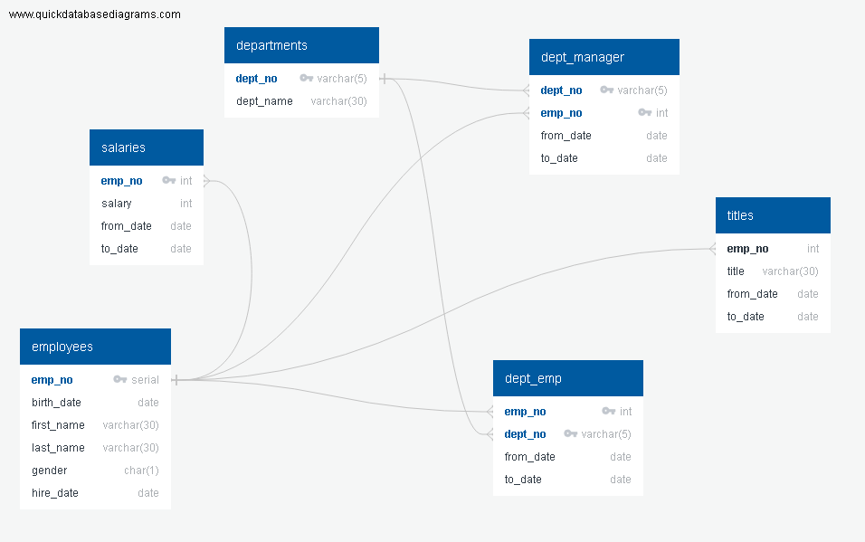
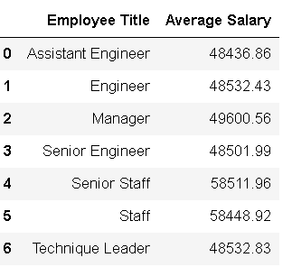
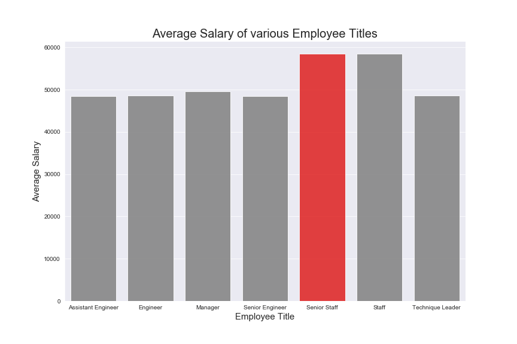

# Employee Database: A Mystery in Two Parts


## Background

This project is do a research on employees of Pewlett Hackard Corporation and find answers to the below questions. The data in CSV files refers back to all employee details from 1980's to 1990's.  In order to perform the analysis, first of all Employee schema was created in PostgreSQL and data was imported from CSV's. Later on imported to Pandas using SQLAlchemy for plotting a bar chart for visualization to verify the integrity of the data.

In this SQL Challenge, following steps are done:


**Data Modelling**

* Create an image file of ERD.

                           ###**Schema Diagram  -   Employee Database**###



**Data Engineering**

* Create a `.sql` file of table schemata.


As part of Data Engineering, based on the CSV data, schema was created for departments, employees, dept_emp, dept_manager, salaries and titles tables. Below are the details.

1) Departments table.

   This is the master table containing  details of all departments by an ID and Department name.
 ```
   "dept_no" varchar(5)   NOT NULL
   "dept_name" varchar(30)   NOT NULL
   
 ```
   Dept_no is identified a primary key and dept_name as not null field.
 
 2) Employees table.
 
    This is the master table containing details of all employees with following attributes.
     
  ```
      "emp_no" serial   NOT NULL
      "birth_date" date   NOT NULL
      "first_name" varchar(30)   NOT NULL
      "last_name" varchar(30)   NOT NULL
      "gender" char(1)   NOT NULL
      "hire_date" date   NOT NULL
    
   ```
   Emp_no will be primary key field which uniquely identifies each employee. Additional details      are employee birth date, first name, last name, gender and hiring date and these fields can't    be empty.
   
 3) Dept_Emp table.
 
   This table contains all employee details and their departments and from_date and to_date in      each departments. Below are the attributes defining this table.
     
   ```
    "emp_no" int   NOT NULL
    "dept_no" varchar(5)   NOT NULL
    "from_date" date   NOT NULL
    "to_date" date   NOT NULL
    
   ```
   Both emp_no and dept_no are identified as foreign keys referencing employees and departments      tables respectively. This table has composite primary key combining emp_no and dept_no which      uniquely identifies the record.
 
 4) Dept_Manager table
 
   This table contains details of all managers and their departments along with managers            from_date and to_date in each departments.
     
   ```
     "dept_no" varchar(5)   NOT NULL
     "emp_no" int   NOT NULL
     "from_date" date   NOT NULL
     "to_date" date   NOT NULL
     
   ```
   Both emp_no and dept_no are identified as foreign keys referencing employees and departments      tables respectively. This table has composite primary key combining emp_no and dept_no which      uniquely identifies the record.
   
  5) Salaries table.
  
   This table contains salary details of each employee and the from_date and to_date.
  
  ```
     "emp_no" int   NOT NULL
     "salary" int   NOT NULL
     "from_date" date   NOT NULL
     "to_date" date   NOT NULL
    
  ```
   Emp_no is definied as the primary key which uniquely identifies each record. Also employee        number is definied as a foreign key referencing Employees table.
  
  6) Titles table.
   
   This table contains all employee titles for employees with their from_date and to_date for        each title. There could be multiple occurrences of an employee number in this table showing      the current and previous titles.
   
  ```
     "emp_no" int   NOT NULL
     "title" varchar(30)   NOT NULL
     "from_date" date   NOT NULL
     "to_date" date   NOT NULL
     
  ```
   Emp_no is defined as foreign key referencing employees table.

   Once all the tables were created, data was copied using postgres _COPY_ command from CSV's to respective tables.
  
   
**Data Analysis**

* Create a `.sql` file of queries to answer below questions.

1. List the following details of each employee: employee number, last name, first name, gender, and salary.

2. List employees who were hired in 1986.

3. List the manager of each department with the following information: department number, department name, the manager's employee number, last name, first name, and start and end employment dates.

4. List the department of each employee with the following information: employee number, last name, first name, and department name.

5. List all employees whose first name is "Hercules" and last names begin with "B."

6. List all employees in the Sales department, including their employee number, last name, first name, and department name.

7. List all employees in the Sales and Development departments, including their employee number, last name, first name, and department name.

8. In descending order, list the frequency count of employee last names, i.e., how many employees share each last name.

9. Verify the integrity of data by plotting a bar chart of average salary for all employee titles.


* Bonus


**Employee Titles Vs Average Salary**





**Analysis**

From the above graph, we see that Senior Staff category has the highest Average salary of 58,511.96 dollars than all other higher title categories. Senior Staff could have salary higher than Staff, but doesn't make sense to have higher salary than all other categories like Manager, Engineer etc. This seems like an anomaly and could be either due to incorrectness of data like an outlier as seen above for Senior staff with employee_no '205000' having a salary of 1,29,492 dollars.
Also average salary of Assistant engineer, engineer and senior engineer are almost same indicating data could be fake.
