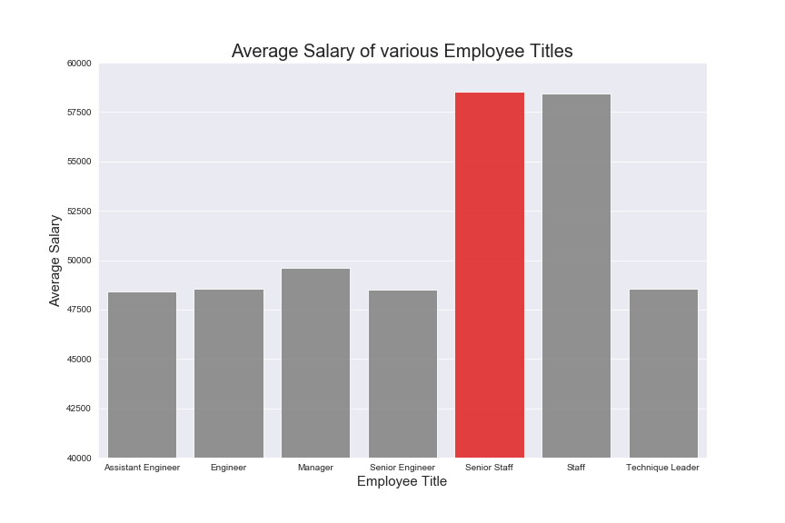

# Employee Database: A Mystery in Two Parts

## Background

This project is do a research on employees of Pewlett Hackard Corporation and find answers to the below questions. The data in CSV files refers back to all employee details from 1980's to 1990's.  In order to perform the analysis, first of all Employee schema was created in PostgreSQL and data was imported from CSV's. Later on imported to Pandas using SQLAlchemy for plotting a bar chart for visualization to verify the integrity of the data.

In this SQL Challenge, following queries have been answered:

1. List the following details of each employee: employee number, last name, first name, gender, and salary.

2. List employees who were hired in 1986.

3. List the manager of each department with the following information: department number, department name, the manager's employee number, last name, first name, and start and end employment dates.

4. List the department of each employee with the following information: employee number, last name, first name, and department name.

5. List all employees whose first name is "Hercules" and last names begin with "B."

6. List all employees in the Sales department, including their employee number, last name, first name, and department name.

7. List all employees in the Sales and Development departments, including their employee number, last name, first name, and department name.

8. In descending order, list the frequency count of employee last names, i.e., how many employees share each last name.

* Create an image file of ERD.

                           ###**Schema Diagram  -   Employee Database**###

* Create a `.sql` file of table schemata.

* Create a `.sql` file of queries.

* (Optional) Create a Jupyter Notebook of the bonus analysis.

